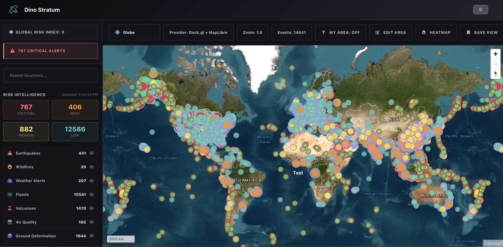
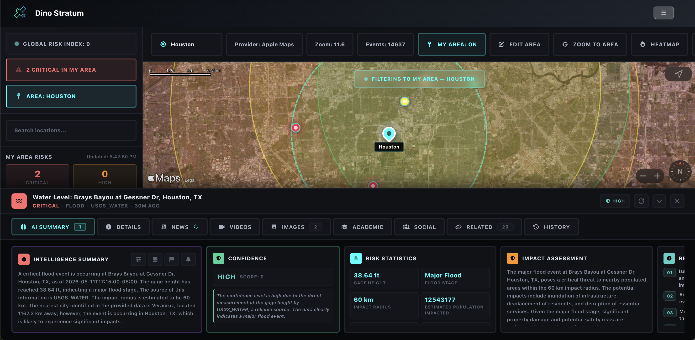
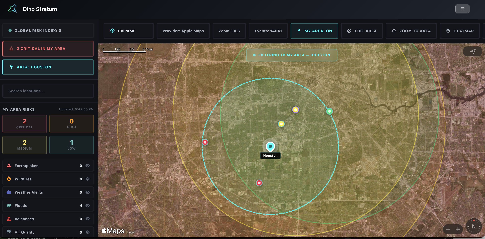
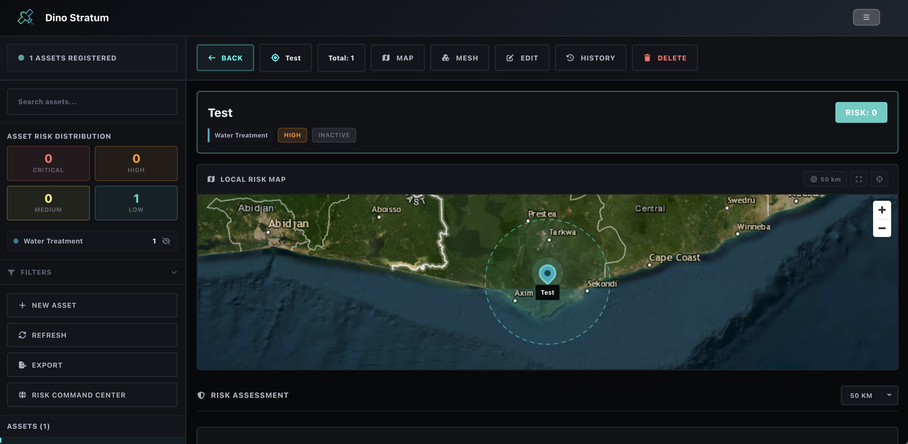
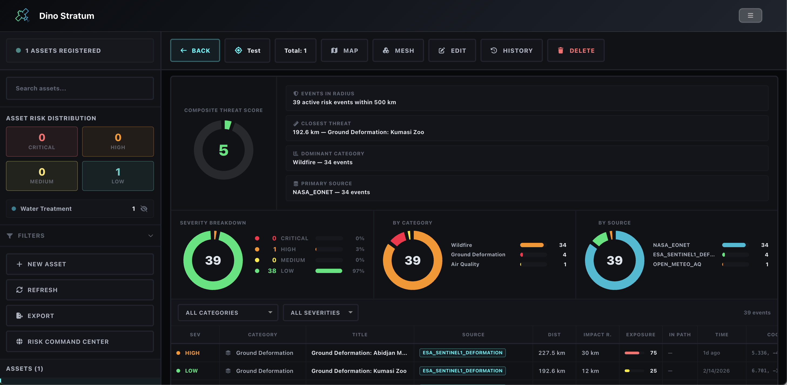
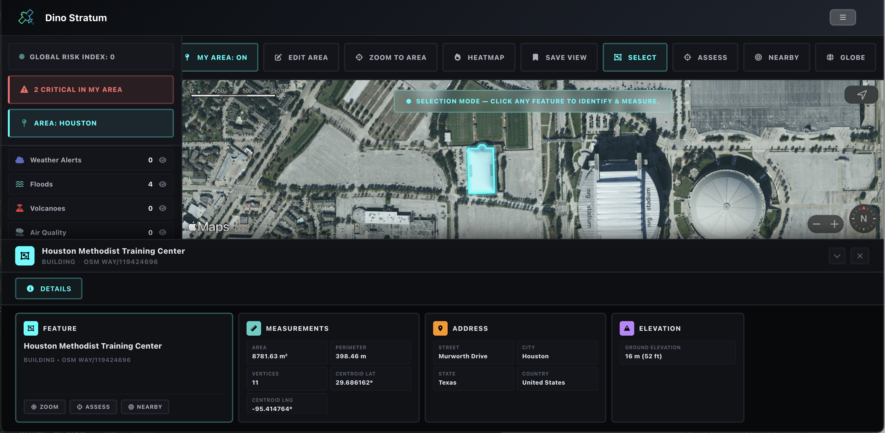

# DinoStratum

DinoStratum is built to be a free, browser-based operational risk platform. It pairs a live multi-hazard intelligence feed with a geospatial asset portfolio, and continuously scores where the two intersect, which active wildfires are near your sites, which earthquakes just shook ground you have buildings on, which storm tracks are headed at your fleet. The kinds of dashboards that normally sit behind enterprise risk-modeling subscriptions, surfaced from public agency feeds and run client-side against your own data.

DinoStratum sits alongside DinoLabs and DinoSat in the same family of projects. DinoLabs is the flagship; DinoStratum is narrower by design, focused on a single operational workflow rather than a broad toolkit. It is still a side project, the hazard math is intentionally transparent rather than commercial-grade, and the cadence of improvements depends on the rest of my life. Feedback is welcome.

The backend here is doing real work. It polls each of the upstream hazard feeds on its own cadence and normalizes them into a single envelope so the frontend doesn't have to care which agency produced what. It also owns the asset store and runs the PostGIS spatial queries that drive exposure scoring on the server side. The frontend still handles all of the rendering, the interactive recompute path, and the report generation, but the split here is closer to symmetric than the deliberately-thin-server pattern I lean on in the other platforms.

Hosted at **[DinoStratum](https://dino-stratum.vercel.app/login)**. Account creation, sessions, and team management are handled through Dino Auth (see below).

**Stack:** React + Vite + Deck.gl + MapLibre GL + Apple MapKit JS on the frontend, Node.js + Express + PostgreSQL with PostGIS on the backend. IndexedDB for cached intel snapshots and the per-pair exposure score cache.

---

## Screenshots

| Risk Management Global | Intel Bar | Risk Management Detail |
|:---:|:---:|:---:|
|  |  |  |

| Asset Management | Asset Risk Assessment | Body Selection |
|:---:|:---:|:---:|
|  |  |  |

---

## The Pages

There are only two pages within the platform and they are built to work together. the risk management page is the live operational view including the map, the intel. bar, and the active event-list. the asset management page is the hub where you can maintain your asset portfolio that the risk management page will score against. The two pages share an asset store and the cached hazards feed, so an edit on either side will propagate to the other without need for a refresh. 

### Risk Management

This is the primary visualization of the platform. It is primarily responsible for everything from the dual-color provider map handoff to the per-category metadata renderers in the right side bar. The page uses a full-bleed map with overlay regions arranged around it including the intel bar to examine specific hazards or assets in detail, a side bar to view summary stats and control the view, and a top bar to toggle between viewing modes. 

#### Dual Map Providers with Automatic Handoff

The map is not a single provider. the component initializes two map instances the work with each other, swapping between the two instantiations on zoom. Below a zoom value of six the page renders through Deck.gl plus MapLibre GL, which gives the page a solid globe-scale view with vector tiles from Esri World Imagery, and a Deck.gl `MapboxOverlay` interleaved into the MapLibre style for each of the custom layers. Beyond a zoom level of six the map renders using Apple MapKit JS, which is a lot stronger for close-in satellite imagery, building footprints, and points of interest. This handoff is handled by a custom-built routine that synchronizes the camera state (center, zoom, pitch, bearing) between the two map providers, hides one DOM container and shows the other, and re-emits the relevant markers and overlays on whichever provider is now active. A guard is also implemented to protect against re-entry during the swap. and a deferred flag ensure Apple annotations are rebuilt one frame after the provider becomes visible (you can't add annotations to a hidden MarkKit container and have them render correctly). The Deck.gl side is the one that handles the heavy custom layer loading, while the Apple Maps side carries native annotations and MapKit markers with radii. 

#### Intel Bar

The intel bar is the tabbed bottom drawer that mounts whenever a risk event, an asset, or a selectable body on the map is clicked. It has two distinct modes. In the risk mode, it surfaces eight tabs of context on the selected event. In the feature mode, triggered by the Overpass click-to-identify integration, it collapses down to a single details tab. Selecting a different risk, asset, or body will reset all of the per-tab data and re-fire all of the fetches against the new selection, so the bar always reflects what is actually clicked.

The summary tab of the interl bar is the AI-generated briefing for the selected event. It starts by gathering a minimal context bundle from the available upstream sources (news articles, social posts, academic papers, related risks in the area) and passes the whole package along the with risk's metadata, location, population impact, and any nearby org assets to a Gemini 2.0 pipeline that returns an executive summary, a list of key findings, a statistics table, an impact assessment with affected areas, a recommendations list, an event timeline, and a self-reported confidence level with rationale. The entirety of the summary section is rendered as a card grid, with the main summary on the left, then a confidence card with a tiered HIGH/MEDIUM/LOW indicator and a breakdown of how many tier-one outlets, tier-two outlets, distinct data sources, and academic references corroborate the event, then a source bundle viewer, then statistics, impact, recommendations, and timeline. If Gemini is unavailable for any reason, the bar will fall back to a deterministic summary built from the raw risk metadata and source counts so the tab is never empty. 

The details tab of the intel bar is the structured event dump. It is rendered as a card grid whose cards vary based on the risk category. This grid includes an overview card with the title, severity badge, score, and quick actions (source link, location assessment, nearby query) which is always present. There is a location and timing card to show the event time, last update, expiry, coordinates, impact radius, and geometry type. There is a population impact card that displays the density tier, estimated population, nearest city, and distance to it when the risk has a resolved location. the detailed data card flattens the entire metadata blob into a clean grid, magnitude and depth for seismic events, percent contained and acres for wildfires, NWS severity and urgency for weather alerts, displacement and coherence for ground deformation, alert level and population affected for GDACS events, and so on for every category. There are also recommendations and source info cards in the grid. When a body is selected through the Overpass identify path instead of a risk, this tab swaps to show the feature's measurements (area, perimeter, vertex count, centroid), address, elevation, and zoom-to-feature controls.

The articles tab of the intel bar pulls all of the collected news coverage of the event from GDELT and GNews, deduplicated by URL and scored against the event by a combination of source tier, recency relative to the event time, and keyword overlap with the event's title and category. Every one of the gathered articles is then passed through a Gemini relevance filter that scores each one of them zero through ten against the actual event (so a generic flood preparedness article scores low while a new article about the specific flood scores high) and items below threshold are dropped. Articles are surfaced as a grid of cards with thumbnails, the source name, relative publish time, a relevance badge, and the provider tag. 

The videos tab of the intel bar functions very similarly to the articles tab but using the YouTube Data API as the data source. The videos are filtered by event time window, scored by view count, channel verification status, and keyword overlap and then verified for relevance using the previously described Gemini verification pipeline. Each card in the grid has the thumbnail, channel title, view count, duration, and a verified/likely/unverified badge informed by the AI relevance score. 

The images tab of the intel bar uses results gathered from Google Custom Search image queries, Wikimedia Commons, and images pulled directly from the news articles found upstream in the articles tab query. the whole pool fo collected images is deduplicated by URL and run through a stricter Gemini visual relevance filter that drops any generic stock images, logos, and maps of the wrong area. the grid, is clickable, opening a full screen viewer with previous and next controls and a caption pointing back to the source. 

The academic tab of the intel bar collects peer-reviewed academic articles from the Semantic Scholar API relevant to the event's category and location. The query is built from a hand-curated category-to-term map (seismic events query "seismology earthquake engineering," wildfires query "wildfire fire science combustion," and so on for every category) plus the event location's string. Results appear in the grid cards with the title, author list, abstract excerpt, publication year, ctation count, and a direct link to the DOI or paper URL. 

The related tab runs a PostGIS spatial query for other risk events within the selected event's impact radius (capped at 500 kilometers) and surfaces them as clickable cards. Each card shows the related event's severity, category, distance from the selected event, source, and event time. Clicking any card navigates the map to that related event and reloads all of the intel bar tabs against the new selection.

The related tab of the intel bar runs a PostGIS spatial query to find all of the nearby risk events within the impact radius of the selected event (capped at 500 km) and surfaces them as clickable cards in the grid. each card shows the related event's severity, category, distance from the selected event, source, and event time. Clicking on any of the cards navigates the map to that related event and reloads all of the intel bar tabs with information for the related event. 

Each briefing produced across tabs in the intel bar is persisted server-side with its source bundle, confidence metrics, scope, asset count, and viewport bounding box. This means that each claim in every summary has its corroborating sources recorded, so users can flag a briefing through the feedback button in the summary header and the recorded sources are captured alongside the flag. the feedback modal collects a category (inaccurate summary, wrong location, off-topic sources, hallucinated content, outdated information, other), a reason, and free-form details. 

I've also implemented a per-user source toggle settings panel in the summary header, which allows users to turn on or off each upstream source provider (GDELT, GNews, Google CSE, YouTube, Google Images, Wikimedia, Semantic Scholar, Reddit, ReliefWeb, Wikipedia). Settings are stored server-side and keyed by username and org, and disabled sources are skipped entirely on subsequent briefing fetches. 

#### Risk Layer Toggles

The platform is designed to monitor several different hazard families simultaneously including earthquakes, wildfires, weather alerts, floods, volcanoes, air quality, ground deformation, and global disasters. Each family can be toggled independently from the sidebar or from the risk layers modal that shows the live event count per family with their category icons. Toggling one of the families off will hide its markers, polygons, and impact circles from the map and removes its contributions from the sidebar summary counts. The modal also has show and hide shortcuts. 

#### My Area

Most users will care about a specific region, not the whole planet. The My Area feature lets you define a personal area of interest as either a point with a radius (circular, useful for "alerts within 100 km of my office") or a bounding box (rectangular, useful for "alerts within this state"). The point mode supports forward geocoding through Nominatim, so you can type an address and the platform will resolve to its coordinates. There is also a built-in use-current-map-center button for the point-mode and a use-current-map-view shortcut for the bounding box mode. The saved area will be mirrored to both PostGIS and local storage so it loads instantly on the next visit. When the area filter is active, very alert, summary count, sidebar list, and exposure number in the page filters down to events inside the area only. The map will also render a dahsed boundary overlay and a labeled center marker so it is always visually clear what region you're scoped to. 

#### Saved Views

The saved view feature is designed to be the bookmark layer. At any moment you can capture the current camera position (center, zoom, pitch, bearing, computed bounding box), all of the active filters (risk layer toggles, my area state), and the active map layer state (satellite vs topo, asset visibility mode, heatmap, visibility badges) into a named view with an optional description. Saved views are stored on the client-side in local storage and server-side keyed by username and org, with conflict-free merging on load. 

#### Location Assessment

The location assessment feature will run a comprehensive risk evaluation against any point on the map. From the header button or the map controls, you can trigger an assessment against the current map center with a configurable radius. The backend will pull all risk events from all categories within the radius, compute a weighted risk score driven by each event's severity, distance, and contribution to the overall composite, and it will return a structured assessment with the overall score, risk level (Critical/High/Medium/Low), the top contributing risk factors with their individual contribution values, a population exposure summary, a list of critical infrastructure within the area pulled from the Wikidata SPARQL dataset, and a count of any active ground deformation zones detected via Sentinel-1 InSAR. The result renders as a modal with a circular score indicator, contributing factors with severity-coded contribution bars, the nearest risks listed by distance with click-through navigation, and a one-click button to save the assessed location as your My Area. 

#### Nearby Query

The nearby query is designed to be a focused spatial search that streams results progressively via SSE rather than waiting fro the full result set. You can configure a center point (manually, from the map center, or from your set My Area), a radius, optional category and severity filters, and an optional source filter. the backend runs a PostGIS query against the entire event cache and streams the results in batches as they come back, sorted. by distance. The results will render in the same panel with severity badges, distance, category, source, and click-through navigation to either the map location or the intel bar for that event. 

#### Health, Ingestion, and Cleanup Dashboards

The platform's operational state is exposed through three in-page dashboards.

The health dashboard runs live latency probes against PostGIS, every required schema table, and every external upstream API. Each of these probes reports OK, NOT_CONFIGURED, or FAILED with a response time, and the overall page health is aggregated into healthy/degraded/unhealthy categories. 

The ingestion dashboard shows the state of the worker that polls upstream feeds on a five-minute cadence. It displays whether the worker is currently running or idle, the configured interval, the current in-memory event count, totals from the most recent run, a per-category breakdown of cached events, and a list of recent ingestion runs with their status (completed, completed with errors, failed) and any error details. There is also a manual trigger button for kicking off an ingestion cycle on demand and a live SSE stream that surfaces per-source progress events as the worker fans out across categories, so you can watch the whole ingest happen in real-time. 

The cleanup dashboard exposes the housekeeping worker that runs every thirty minutes. the worker deleted rows with no location data, deletes events expired past their grace window, deduplicates rows with the same source/source id pair (keeping the newest), backfills the geometry column for rows that have latitude/longitude but not PostGIS geometry, runs analysis on the vents cache for query planner stats, and urges ingestion run records older than the retention window. The dashboard will show whether the worker is currently running and the full set of configuration values (batch sizes, max iterations, grace days, retention days), and has a manual trigger button. 

### Asset Management

This is the second of the two pages and the registry where the org's portfolio of physical assets lives. The exposure scoring on the Risk Management page is computed against this registry, so it is the system of record for everything the platform considers an "owned" asset.

#### Asset Schema

Every asset has a core profile: name, type (one of sixteen categories spanning Pipeline, Port, Factory, Warehouse, Power Plant, Data Center, Refinery, Mine, Office, Retail, Residential, Agricultural, Transportation Hub, Telecommunications, Water Treatment, and Other), priority tier, status, latitude and longitude, optional elevation, a full address block, a free-form description, tags, an optional image URL, an optional external ID for cross-referencing with other systems, and an arbitrary JSON metadata blob.

Each of the sixteen asset types carries a built-in vulnerability matrix on the backend that maps hazard categories to vulnerability factors. A pipeline has a high vulnerability to floods and seismic events but a lower one to weather; a mine has a high vulnerability to landslides and ground deformation; a data center has high vulnerability to power-related events and lower vulnerability to ground motion. These factors feed directly into the per-risk exposure score that the platform computes for every asset/event pair.

Assets can also carry one or more golden mesh baselines, which are reference three-dimensional point clouds used by the ground deformation change detection path. Assets without a baseline still get standard distance-and-severity exposure treatment. Assets with a baseline get an additional per-point millimeter-level delta analysis on every detection run.

Assets are scoped to an organization, and every create, update, delete, risk assessment, zone link, and mesh operation is recorded in an audit log with the acting user, the old and new values, the request metadata, and a timestamp.

#### Global Overview Map

The list view is topped by a full-width overview map that renders every asset in the registry. It uses the same dual-provider handoff pattern as Risk Management with MapLibre for global views and Apple MapKit for close-in views. Each asset renders as a styled marker pin colored by asset type with a border colored by risk score, a name label, and an animated pulse ring on assets with risk scores above fifty. Clicking a marker opens the detail view for that asset. A fit-to-portfolio button fits the camera to the bounding box of all assets, and a globe button resets to the full-globe view.

#### Asset Card Grid

The main content below the overview map is a sortable card grid. Each card shows the asset name, type with a color dot matching its assigned color, a risk score badge color-coded from green through red, priority and status badges, a location line, up to five tag chips, an updated-X-ago timestamp, and a row of action buttons for editing, opening the golden mesh manager, deep-linking to Risk Management at the asset's coordinates, and deleting the asset.

The grid supports seven sort fields (risk score, name, type, priority, status, last updated, created) with ascending and descending order. The left sidebar exposes filters by asset type (click-to-toggle from the type breakdown), priority tier, status, tags, and a full-text search that matches across name, description, and city. All filters and sort state are applied server-side. There is also a JSON export that writes a timestamped file with the full payload for every asset in the org.

#### Asset Detail View

Clicking any asset card or sidebar list entry transitions to a full-page detail view. The view opens with a header card showing the name, the risk badge, the type, priority, and status badges, and a location chip, followed by the local risk minimap, then the risk assessment dashboard, then a two-column detail grid with location fields on the left and metadata and audit fields on the right, then any linked risk zones and active alerts.

#### Local Risk Minimap

The local risk minimap is centered on the selected asset's coordinates with a geodesic radius circle drawn at the configured search distance. The asset itself renders as a styled pin with a name label and a pulse ring, and every nearby risk event renders as a colored dot sized by severity with a popup containing the severity badge, category, title, distance from the asset, time, and impact radius. The radius is configurable from the minimap header (10, 25, 50, 100, 150, 250, or 500 km), and changing it re-runs the nearby risk fetch against the new radius.

The nearby risks are fetched through the same SSE streaming endpoint used by the Risk Management page's nearby query, with client-side deduplication by a composite key. The stream emits batches as the PostGIS query resolves, so the minimap populates progressively rather than waiting for the full result set. An open-in-risk-command-center button deep-links to the Risk Management page at the asset's coordinates with the asset ID in the query parameters.

#### Risk Assessment Dashboard

The risk assessment dashboard is the analytical centerpiece of the detail view. The top row shows a composite threat score as a large donut chart with the numeric score in the center, color-coded from green through red. The score is computed from a weighted formula that accounts for the count of Critical, High, Medium, and Low severity events in the radius with additive bonuses for any Critical events present and for any events whose impact radius overlaps the asset's position. A metadata column next to the donut shows total events in radius, the closest threat by distance and title, the dominant hazard category, the primary data source, and warning banners for any events that overlap the asset's impact radius or that are on a direct trajectory toward it.

The bottom row shows three side-by-side breakdown cells, each with its own donut and a set of horizontal bar charts: a severity breakdown, a category breakdown of the top hazard families, and a source breakdown of the top contributing data providers.

Below the summary sits a sortable, filterable risk event table with columns for severity, category, title (with an in-radius badge when the event's impact radius overlaps the asset), source, distance, impact radius, exposure score (rendered as a progress bar), in-path status, time, and coordinates. Clicking any row opens the nearby risk detail modal.

Exposure scoring for each risk event is computed server-side. The formula multiplies the severity weight (Critical 100, High 75, Medium 40, Low 15) by the asset type's vulnerability factor for the risk's hazard category, by a distance decay factor that falls linearly from 1.0 at zero kilometers to 0.0 at five hundred, with a 1.2x multiplier applied if the asset sits inside the event's stated impact radius. The result is capped at 100 and attached to each risk as the asset's exposure score. The detail modal also surfaces the individual contributing factors with their weights, so users can see exactly why an event scores the way it does against a given asset.

#### Nearby Risk Detail Modal

Clicking any row in the risk table opens a full-detail modal for a single risk event in the context of the selected asset. The modal shows the title with the exposure score badge, severity and category badges with source and distance chips, the description, an asset impact analysis box with a natural-language summary of the risk's relationship to the asset, an event details grid with event time, last update, impact radius, distance in both kilometers and meters, coordinates, severity score, expiry, geometry type, probability percentage, propagation velocity, time to impact, and an in-direct-path flag, an exposure factors section with weighted bars for each contributing factor, a population impact section, a source metadata section that flattens the entire metadata blob into label/value pairs, a golden mesh detection section when the risk carries one, a recommendations list, and a source URL link.

#### Location Picker Map

The create and edit asset modals embed a location picker map, which uses the same dual-provider stack. It initializes centered on the asset's current coordinates or on a globe view if creating a new asset with no coordinates yet. Click anywhere on the map to place a pin; drag the pin to reposition it. The resulting coordinates are written back into the latitude and longitude form fields in real time.

#### Golden Mesh Baseline Manager

The golden mesh system is accessed through a Mesh button on any asset card or the detail view header and opens a modal stack that covers the full baseline lifecycle.

The baseline list modal shows every golden mesh baseline registered for the asset, each rendered as a card with status (Active or Superseded), vertical datum, sensor source, format, whether a binary file is attached, the processing status (from a seven-stage pipeline of pending, uploading, processing, decimating, reprojecting, converting, completed, or failed), the baseline source (manual upload, USGS 3DEP, satellite DEM, synthetic, or legacy JSON), horizontal and vertical accuracy, point density, point count, scan date, and notes.

The discover data action queries the USGS 3DEP LiDAR coverage index for the asset's coordinates and returns a tiered result: Tier A if high-resolution LiDAR coverage is available with a one-click import button, or Tier B if only satellite DEM is available at 30-meter resolution from the Mapzen Terrain Tiles.

The synthesize baseline action auto-generates a baseline from public data without any file upload. The backend generates a synthetic elevation grid at the specified resolution, stores it in PostGIS as a MultiPointZ geometry with a parallel double-precision array column for z-values, and registers it as the active baseline with the previous active baseline marked as superseded. Three source types are supported: USGS 3DEP, satellite DEM, and pure mathematical approximation. The synthesized baseline is immediately usable for change detection.

The register-new-baseline form accepts a drag-and-drop file upload (las, laz, copc.laz, ply, xyz, csv, tif, tiff up to 2 GB), vertical datum selector, sensor source, horizontal and vertical accuracy, point density, and notes. On submit, the file is uploaded either to S3 via a signed PUT URL or to a local upload directory via a streaming POST, then dispatched to a PDAL worker for processing through a five-stage pipeline (validate, decimate, reproject, convert to COPC) with progress polling. If the PDAL worker is unavailable, the backend falls back to a simulated processing path that generates a synthetic point cloud and completes the registration.

The run-detection action opens a modal with two detection modes. Autonomous satellite sync queries the event cache for ground deformation events near the asset's coordinates, extracts the displacement delta from the InSAR metadata, applies that delta uniformly to the baseline point cloud, and runs a per-point comparison against the baseline to produce a detection record with max, mean, and standard deviation deltas, affected point count and percentage, hotspot coordinates and directions (subsidence or uplift), and an overall severity classification. Upload comparison scan accepts a second point cloud file and runs the same comparison pipeline.

The detection history modal lists every detection run for the asset, sorted by date, each showing the severity badge, detection time, acknowledgment status, max delta, mean delta, and affected percentage. Clicking a detection opens a detail modal with the full metric grid, detection mode, deformation source, and the acknowledgment workflow: a pending detection can be acknowledged with notes and the acknowledging user recorded, and an acknowledged detection can be resolved with resolution notes and the resolving user recorded. This three-state workflow is the operational loop that connects the automated satellite detection to the human decision about whether the detected deformation requires action.

#### History

Every risk score change on an asset is recorded in a per-asset history table with the score, the risk factors that produced it, the asset's status at the time, the source of the assessment, and the timestamp. The history modal surfaces this as a chronological list. The backend also maintains a full audit log of every CRUD operation on every asset.

---

## Architecture

DinoStratum is split across two repos: a React frontend (`dinostratumweb/`) and a Node.js/Express backend (`dinostratum_webapi/`). The backend hosts the asset and portfolio CRUD routes, the intel-bar feed proxy and its cache, the server-side exposure scoring path, and the Dino Auth integration. The frontend handles all of the map rendering, the interactive scoring path, and the report generation. Exposure scoring is implemented on both sides, the client runs it interactively for everything that lives in its cache, and the server runs it on demand for any asset-event pair the client doesn't already have a result for, and for report generation jobs.

### Frontend (`dinostratumweb/`)

```
dinostratumweb/
├── public/
│   ├── hazard-icons/            Per-hazard-family icon set used by the intel bar and map
│   ├── map-styles/              MapLibre style JSON files
│   ├── ref-images/              Reference imagery
│   ├── ref-logos/               Brand assets
│   ├── DinoStratumLogo*.png
│   └── EarthBackground.mp4
├── src/
│   ├── pages/
│   │   ├── Authentication/
│   │   │   ├── AuthLogin.jsx
│   │   │   ├── AuthRegister.jsx
│   │   │   ├── AuthReset.jsx
│   │   │   └── AuthVerifyEmail.jsx
│   │   ├── DinoStratumAccount/
│   │   │   ├── DinoStratumAccount.jsx
│   │   │   └── DinoStratumTeam.jsx
│   │   ├── DinoStratumRisk/
│   │   │   ├── RiskCommandCenter.jsx          ~2000-line dual-provider map shell
│   │   │   ├── IntelBar.jsx                   Right-rail selection inspector
│   │   │   ├── DinoStratumEventList.jsx
│   │   │   ├── DinoStratumExposure/
│   │   │   │   ├── earthquakes.js
│   │   │   │   ├── wildfires.js
│   │   │   │   ├── cyclones.js
│   │   │   │   ├── severeWeather.js
│   │   │   │   ├── volcanoes.js
│   │   │   │   ├── tsunami.js
│   │   │   │   ├── floods.js
│   │   │   │   ├── airQuality.js
│   │   │   │   └── groundDeformation.js
│   │   │   └── DinoStratumReport.jsx
│   │   ├── DinoStratumAssets/
│   │   │   ├── DinoStratumAssetTable.jsx
│   │   │   ├── DinoStratumAssetMap.jsx
│   │   │   ├── DinoStratumAssetDrawer.jsx
│   │   │   ├── DinoStratumImporter.jsx
│   │   │   └── DinoStratumPortfolios.jsx
│   │   ├── DinoStratum.jsx                Workspace shell
│   │   └── DinoStratumNoPortfolio.jsx
│   ├── helpers/
│   │   ├── MapHelpers/
│   │   │   ├── ClusterIcon.jsx
│   │   │   ├── LayerStyles.js
│   │   │   └── GeometryEdit.js
│   │   ├── FeedHelpers/
│   │   │   ├── FeedClient.js              Calls the backend SSE endpoints, manages IndexedDB cache
│   │   │   └── FeedNormalizers.js         Per-family normalizers to the envelope shape
│   │   ├── Alert.jsx
│   │   ├── ColorPicker.jsx
│   │   ├── Loading.jsx
│   │   ├── Mobile.jsx
│   │   ├── Nav.jsx
│   │   └── Unavailable.jsx
│   ├── styles/
│   │   ├── helperStyles/        Shared component styles
│   │   └── mainStyles/          Per-page styles
│   ├── App.jsx
│   ├── ErrorBoundary.jsx
│   ├── ProtectedRoute.jsx       Token gate, redirects to Dino Auth
│   ├── TouchDevice.jsx          Mobile-block screen
│   └── UseAuth.jsx              Dino Auth hook
├── Dockerfile
├── eslint.config.js
├── vite.config.js
└── vercel.json
```

### Backend (`dinostratum_webapi/`)

```
dinostratum_webapi/
├── api/
│   ├── config/
│   │   ├── db.js                PostgreSQL pool with PostGIS enabled
│   │   ├── s3.js                Object storage client, used for report PDFs
│   │   └── smtp.js              Transactional mail
│   ├── middleware/
│   │   ├── auth.js              Dino Auth token validation
│   │   ├── errorLogger.js
│   │   └── rateLimiter.js
│   ├── routes/
│   │   └── dinostratum-playground/
│   │       ├── dinostratum-playground-assets.js
│   │       ├── dinostratum-playground-portfolios.js
│   │       ├── dinostratum-playground-intel.js         Streaming SSE intel endpoints
│   │       ├── dinostratum-playground-exposure.js
│   │       └── dinostratum-playground-user-area.js     My Area and Saved Views
│   ├── workers/
│   │   ├── feedFetcher.js       Universal dispatcher across 28 upstream feeds
│   │   ├── writeQueue.js        Batched PostGIS upserts with retry and backoff
│   │   ├── cleanupWorker.js     30-minute cleanup cycle
│   │   ├── dynamicRefresh.js    24-hour Wikidata SPARQL refresh
│   │   └── reportBuilder.js     Server-side fallback for exposure report PDF generation
│   ├── public/                  Catchall and static
│   ├── docs/
│   └── index.js
└── vercel.json
```

The backend has a lot more going on than the DinoLabs backend because the hazard feeds need a polite consumer in front of them and because the spatial joins are most efficient where the geometry already lives.

The **asset and portfolio routes** are standard REST against PostGIS-aware tables. The **intel routes** serve all hazard families through a unified streaming endpoint per category and through a streaming nearby-spatial endpoint, both built on SSE rather than long-poll, with per-source chunks emitted as each upstream feed resolves. The **exposure route** runs `ST_Intersects`, `ST_Distance`, and `ST_DWithin` against the active portfolio and the cached event geometries when invoked from the server side. The **user area routes** handle the per-user preferred area (point-radius or bbox) with the area's PostGIS geometry materialized at write time (via `ST_Buffer` for radii and `ST_MakeEnvelope` for boxes) so that intersection queries against `risk_events_cache` are a single indexed spatial join. Everything user-related, auth, profile, team, passes through to Dino Auth.

A handful of operational endpoints also sit alongside the data routes: `/risk/intelligence/ingest/status`, `/risk/intelligence/ingest/trigger`, `/risk/intelligence/cleanup/status`, `/risk/intelligence/cleanup/trigger`, `/risk/intelligence/health`, `/risk/intelligence/dynamic-data/status`, and `/risk/intelligence/dynamic-data/refresh`. These are what back the in-page Health, Ingestion, and Cleanup dashboards described above, and they're also useful as a one-stop check when something looks wrong in the data.

### Persistence
- **PostgreSQL + PostGIS.** Holds assets, portfolios, the asset edit history log, the server-side hazard event cache (`risk_events_cache` with a `geom geography(Geometry, 4326)` column for indexed spatial queries), the per-user preferred area (`risk_user_areas`), the saved views (`risk_user_views`), and the ingestion run audit log (`ingestion_runs`). Asset geometry is a real PostGIS geometry column, which is what makes the server-side exposure path inexpensive enough to be the fallback rather than a workaround.
- **IndexedDB.** Cached intel feed snapshots, in-flight asset edits before they're committed, and the per-pair exposure score cache. All of it survives reloads.
- **Local Storage.** The user's preferred area and area-filter active state are mirrored here in addition to PostGIS, so the UI can render the area immediately on reload without waiting on a server round-trip. Saved views are similarly mirrored.
- **In-Memory Stores.** The backend keeps a `riskStore` of up to fifty thousand recent events keyed by id with severity-weighted eviction, a Wikidata-sourced dynamic reference cache (urban centers, infrastructure, deformation zones, fault lines) refreshed every twenty-four hours, an Overpass query cache with FNV-hashed keys and twenty-four hour TTL, and a fixed-budget write queue in front of PostGIS that batches up to five hundred upserts at a time with up to three retries and exponential backoff with jitter on retryable errors.

### Map
The frontend uses Deck.gl with MapLibre GL for global views and Apple MapKit JS for close-in views, with an automatic handoff at zoom level six. The hosted version uses Apple's MapKit JS token and Esri World Imagery tiles for the MapLibre side. Self-hosters can substitute their own MapKit token and any MapLibre-compatible style.

### Data sources

The platform is now pulling from roughly twenty-eight upstream feeds across ten hazard families:

- **USGS Earthquake Hazards Program.** Public GeoJSON feeds, no key required.
- **EMSC (European-Mediterranean Seismological Centre).** Public FDSN-format JSON feed.
- **INGV (Italy).** Public FDSN GeoJSON feed covering Italy and the Mediterranean.
- **GeoNet (New Zealand).** Public API covering New Zealand earthquakes and volcanic activity.
- **NIFC WFIGS.** Wildland fire perimeters through the WFIGS Interagency Perimeters feature service.
- **NOAA NWS Alerts API.** Public alerts feed, no key required.
- **NOAA SPC.** Storm Prediction Center day-one, day-two, and day-three convective outlooks as GeoJSON.
- **Open-Meteo Air Quality.** CAMS global atmospheric composition, no key required.
- **Open-Meteo Flood.** GloFAS-driven river discharge forecasts, no key required.
- **Open-Meteo Marine.** GFS Wave global sea state, no key required.
- **USGS Water Services.** Real-time stream gauge observations, no key required.
- **USGS Volcano Hazards Program.** Volcano alert levels and aviation color codes through the volcanoApi.
- **NOAA Tsunami Warning Centers via NWS Tsunami.** Public CAP feed.
- **NOAA SWPC Alerts.** Real-time space weather alerts.
- **NOAA SWPC Kp Index.** Current planetary Kp index.
- **NOAA SWPC Kp Forecast.** Three-day Kp forecast.
- **NOAA SWPC X-Ray Flux.** GOES X-ray flux observations.
- **NOAA SWPC Solar Wind Plasma.** DSCOVR/ACE solar wind plasma observations.
- **NOAA SWPC Interplanetary Magnetic Field.** DSCOVR/ACE IMF Bz observations.
- **GDACS.** Global Disaster Alert and Coordination System events with red, orange, and green alert levels.
- **NASA EONET.** Earth Observatory Natural Event Tracker, public API.
- **FEMA.** US disaster declarations via the OpenFEMA v2 API.
- **ESA Sentinel-1 InSAR via ASF DAAC.** Sentinel-1 GUNW interferogram products through the ASF search API.
- **Copernicus EGMS.** European Ground Motion Service mean LOS velocity points.
- **Wikidata SPARQL.** Dynamic reference dataset for urban centers and critical infrastructure (dams, pipelines, ports, nuclear plants, bridges, tunnels, fault lines, extraction sites, mines).
- **Nominatim.** Reverse geocoding for asset address auto-fill and forward geocoding for the My Area address field. Self-hosters should swap in their own geocoder for any non-trivial volume, since the public Nominatim instance is rate-limited aggressively.
- **Overpass API.** Used by the click-to-identify feature selection path on both the Risk Management and Asset Management pages, with multi-mirror failover across four public Overpass instances.
- **Wikipedia REST API.** Used opportunistically to enrich identified features that have a `wikipedia` tag.
- **Open-Elevation.** Used opportunistically to attach ground elevation to identified features.

---

## Hosted Version

The supported way to use DinoStratum is the hosted version at [DinoStratum](https://dino-stratum.vercel.app/login). The hosted instance is what owns the feed polling schedule, the cache layer, and the report generation queue, running these in a single shared backend is what keeps the platform a good citizen of the upstream agency APIs. Account creation and usage are free for now.

This repository is here as a reference and as the development home of the project. Self-hosting works but isn't the supported path, and the upstream feeds will rate-limit you faster than you'd expect if you try to run the platform without the proxy and cache layer in place.

---

## Setup (self-hosting)

If you do want to stand it up yourself, here's the shape of it.

### Requirements
- Node.js 20 or later
- PostgreSQL 15 or later with the PostGIS extension installed
- A modern browser with WebGL 2 (a MapLibre GL and Deck.gl requirement)
- API keys for an Apple MapKit JS token, a MapTiler key or equivalent MapLibre basemap provider, and (optional but recommended) keys for whichever upstream feeds require them (FIRMS, AirNow if you wire it back in)

### Build

Both repos run independently.

**Frontend (`dinostratumweb/`)**
1. `npm install`
2. Create a `.env` with the API base URL, auth provider config, Apple MapKit token, and basemap key
3. `npm run dev` for local development, `npm run build` for production

**Backend (`dinostratum_webapi/`)**
1. `npm install`
2. Create a `.env` with database URL, S3 credentials, SMTP config, auth provider config, and the upstream hazard feed keys
3. `npm run db:migrate`, this also enables the PostGIS extension if your Postgres role has permission, otherwise enable it manually first
4. `npm run dev` for local, `npm start` for production

### Environment variables
No `.env.example` is shipped with this repo. The ones you cannot skip on the backend:

- `DATABASE_URL`
- `AUTH_PROVIDER_URL`
- `AUTH_JWT_PUBLIC_KEY`
- `S3_ENDPOINT`, `S3_BUCKET`, `S3_ACCESS_KEY`, `S3_SECRET_KEY`
- `SMTP_HOST`, `SMTP_USER`, `SMTP_PASS`
- `ADMIN_API_KEY` (gates the admin-only cache clear endpoint)

On the frontend:

- `VITE_API_BASE_URL`
- `VITE_AUTH_PROVIDER_URL`
- `VITE_APPLE_MAPS_KEY`
- `VITE_MAPTILER_KEY`

---

## License

Apache License 2.0 with a Commons Clause restriction, same as the rest of the DinoLabs family. Read it, fork it, modify it, run it for non-commercial purposes, but no selling, sublicensing, or offering it as a hosted commercial service. The intent is to keep the source open as reference without giving up the commercial rights. See `LICENSE` for the full text.
